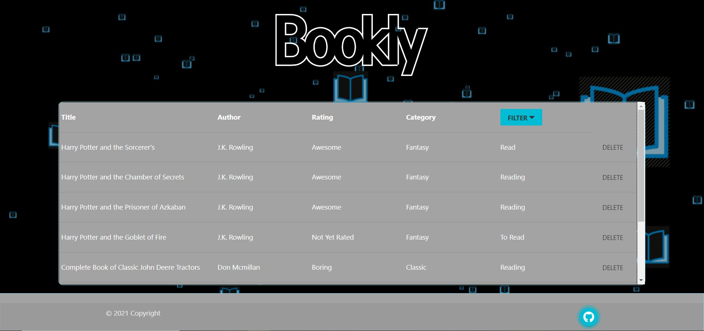

---
# BOOKLY
​
## Description 
Stand alone application for the aspired reader that would liket to keep track of their reading history. 
​
## Table of Contents
​
* [Installation](#Installation)
* [Usage](#Usage)
* [Contributing](#Contributing)
* [Tests](#Tests)
* [Questions](#Questions)
* [License](#License)
​
​
## Installation
​
This app is deployed on heroku.

To install this application use the following steps:

1. git clone https://github.com/Eamon02/Bookly.git
2. cd Bookly/
3. npm install
4. to enter your MySql password in the .env file
​
## Usage 
​
Store all the books are you are reading have read or will want to read. The app stores the information in a database that allows the user to assign a reading status of three choices. 
1. Having read
2. Reading
3. To read
​
It keeps track of category and user rating as well the above mentioned reader status. 
​
The reader can easily keep a record of his/her progress.
​
​
## Contributing
​
This is an open source project. Updates are welcome.
​
​
## Tests
​
Simply launch
​
​
## Questions
​
Github user name: [Eamon02](https://github.com/Eamon02)
​
Contact email: [n/a](mailto:n/a)

## Image of the Webpage

​
## License
​
Licensed under the [MIT](MIT%20License.txt) license.
​
---
​
© 2020 Wodahouse.com dwyhd (do what your heart desires) Readme Generator Generated